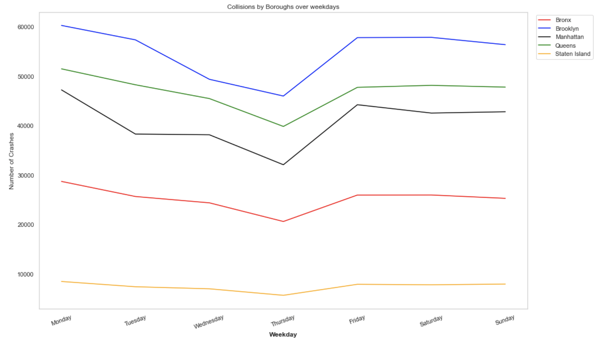
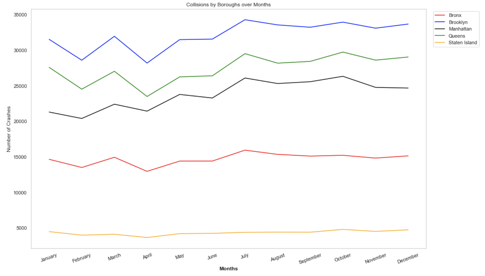

The following section wants to give a better overview of the time of occurence of the vehicle collisions. This includes visualising the collissions on an hourly, weekly and monthly basis. This will be done using plots and interactive heatmaps(*).

# Hourly occurences

Taking a look at the timeline on an hourly basis, it can be seen that being an early bird or staying up late reduces the risk of being in a car collision. This is due to the fact that most of the crashes happen between 8 AM and 7 PM. This makes sense at there is the most traffic and number of cars on the road in this period. So if you want to be more cautios, the city seems to be safest between 10 PM and 8 AM if you are driving a vehicle. This trend is shown for all of the Boroughs, altough the number of occurences vary a lot. 

<iframe src="map_hourly.html"
    sandbox="allow-same-origin allow-scripts"
    width="100%"
    height="500"
    scrolling="no"
    seamless="seamless"
    frameborder="0">
</iframe>

# Weekly occurences

When looking at the tendency for the different weekdays, there is a downward going trend on thursdays and also slightly wednesdays for all of the boroughs. So apparently people drive safer on thursdays. Who whould have tought! On the other hand Monday is the day with the highest number of crashes. What a surprise ... 

<iframe src="map_weekly.html"
    sandbox="allow-same-origin allow-scripts"
    width="100%"
    height="500"
    scrolling="no"
    seamless="seamless"
    frameborder="0">
</iframe>

# Monthly occurences

The tendency for the monthly occurences of crashes is very similar in the different boroughs. Against all believe, there is actually the lowest number of occurences in the wintermonths January & February. This might be due to the fact that people drive extra carefull when there is bad weather, ice on the roads, snow etc. The highest number of occurences on the other hand is during the summermonths and especially in July. According to different sources [1](https://www.hg.org/legal-articles/car-accidents-more-likely-during-summer-40867) & [2](https://www.hg.org/legal-articles/car-accidents-more-likely-during-summer-40867) this is due to the fact that during this period more inexperienced drivers are on the road, more riders, cyclists and pedestrians share the roads and there is more construction work.

<iframe src="map_monthly.html"
    sandbox="allow-same-origin allow-scripts"
    width="100%"
    height="500"
    scrolling="no"
    seamless="seamless"
    frameborder="0">
</iframe>
