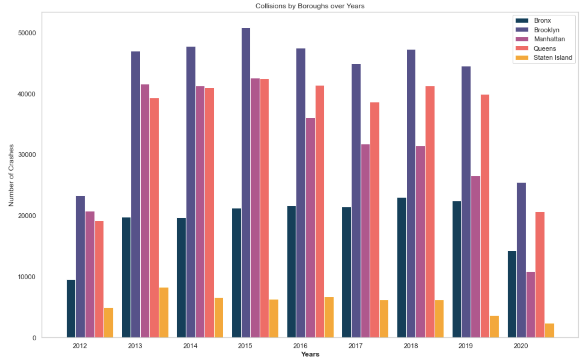
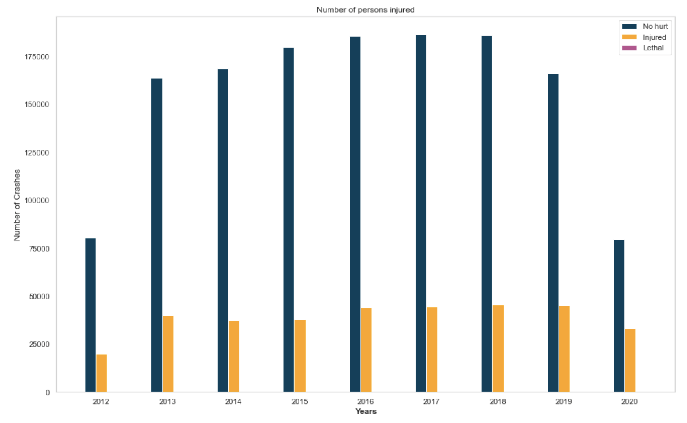
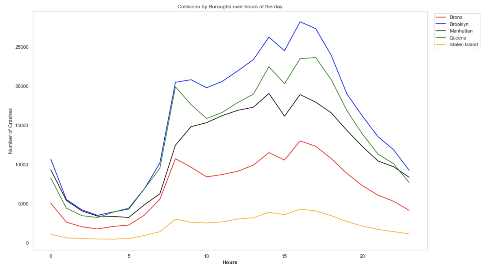
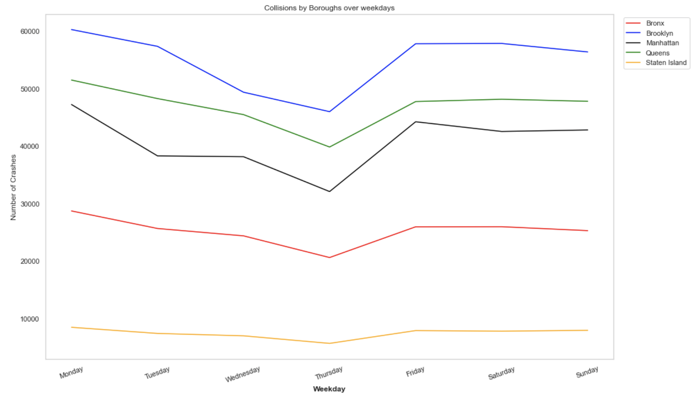
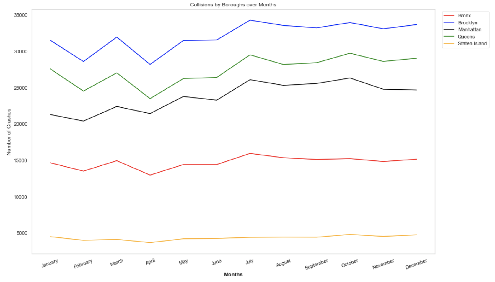
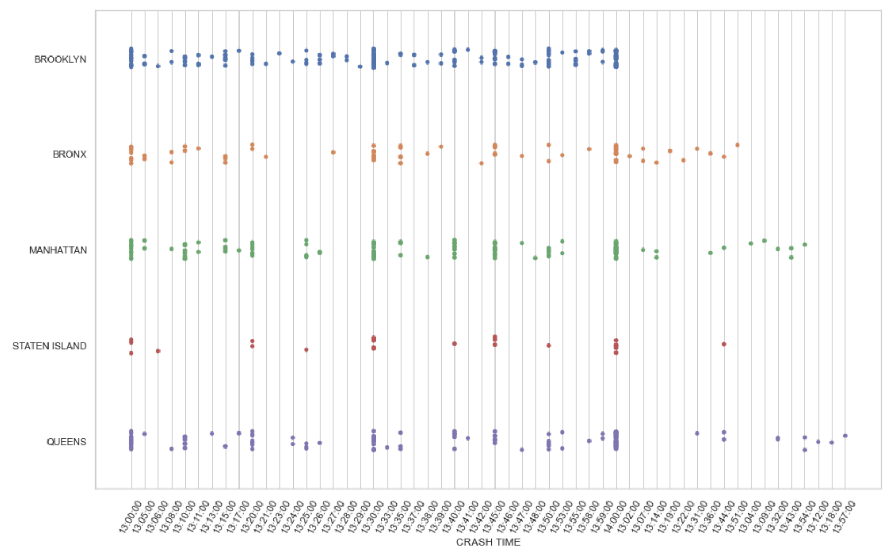
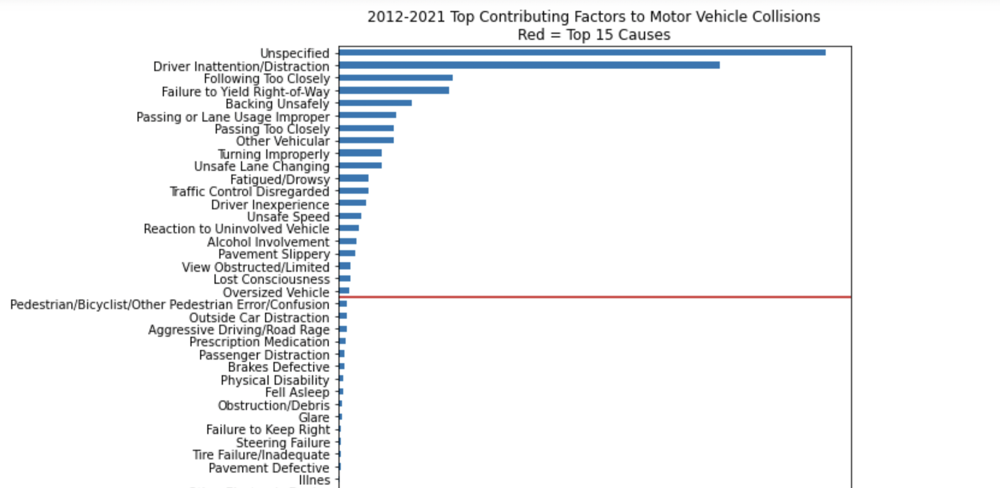
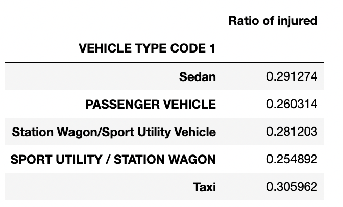

In the following section, different information and data about vehicle colissions in New York City will be visualized using bar plot, graphs and other tools.

**Collision by boroughs in the period from 2012-2020**

It seems that the number of crashes has been increasing slowly up until COVID-19 as 2020 has much less collisions. So in terms of being in a car collision in NY, it seems that you are safer now than ever before. Maybe it is time for that vacation, unless something else is holding you back. 

**Numbers of serious incidents**

Luckily the numbers of deaths from car crashes is extremely small, and is nearly insignificant compared to the total amount of crashes happening. This is probably due to the relative slow pays that people are driving at in New York. However serious and lifelong lasting injuries may still occur.  

# Timeline 

**Hourly plot of collisions**

Taking a look at the timeline on an hourly basis, it can be seen that being an early bird or staying up late reduces the risk of being in a car collision. This is due to the fact that most of the crashes happen between 10 AM and 7 PM. This makes sense at there is the most traffic and number of cars on the road in this period. So if you want to be more cautios, the city seems to be safest between 10 PM and 9 AM if you are driving a vehicle. This trend is shown for all of the Boroughs, altough the number of occurences vary a lot. 

**Weekly plot of collisions**

When looking at the tendency for the different weekdays, there is a downward going trend on thursdays and also slightly wednesdays for all of the boroughs. So apparently people drive safer on thursdays. Who whould have tought! On the other hand Monday is the day with the highest number of crashes. What a surprise ... 

**Monthly plot of collisions**

The tendency for the monthly occurences of crashes is very similar in the different boroughs. Against all believe, there is actually the lowest number of occurences in the wintermonths January & February. This might be due to the fact that people drive extra carefull when there is bad weather, ice on the roads, snow etc. The highest number of occurences on the other hand is during the summermonths and especially in July. According to different sources [1](https://www.hg.org/legal-articles/car-accidents-more-likely-during-summer-40867) & [2](https://www.hg.org/legal-articles/car-accidents-more-likely-during-summer-40867) this is due to the fact that during this period more inexperienced drivers are on the road, more riders, cyclists and pedestrians share the roads and there is more construction work.

# Errors 

Such a big dataset will of course always contain some erros. 
The jitterplot shows at what time the different crashes have happened, or at least at what time they are registrered. 

It is clear that there is a tendency towards a lot of the occurences being listed at 13:00, 13:10, 13:20, 13:30 and 14. This may indicate that exact time of the collision is not always written down, but that it is rounded up or down to 10 minutes, full or half hours. 

Overall this implicates that the people are indeed a little bit lazy in noting down the exact time. Because purely logical speaking there should be exactly the same amount of dots for each minute.

# Top contributions to accidents

The top causes to accidents are visualised below.

Among these it is especially:
- Driver inattention/Distraction
- Following to closely
- Failure to yield right-of-way

If you are actually on the road getting from A to B, make sure to be extra careful around drivers looking at their phone. The most common reason why people are injured in car crashes in NY is because a driver of a sedan,  a station wagon or a SUV is distracted from actually driving. 

Furthermore, it is not only important to stay away of distracted drivers but the vehicle type you are in also plays an important role in your chances of avoiding an injury.
New York is quite famous for their yellow Taxis but statistics show that being in a car crash while driving Taxi in New York has the highest risk of 0.30.
This is shown in the table below where the risk of being injured is calculated for the 5 vehicle types causing the most crashes.

